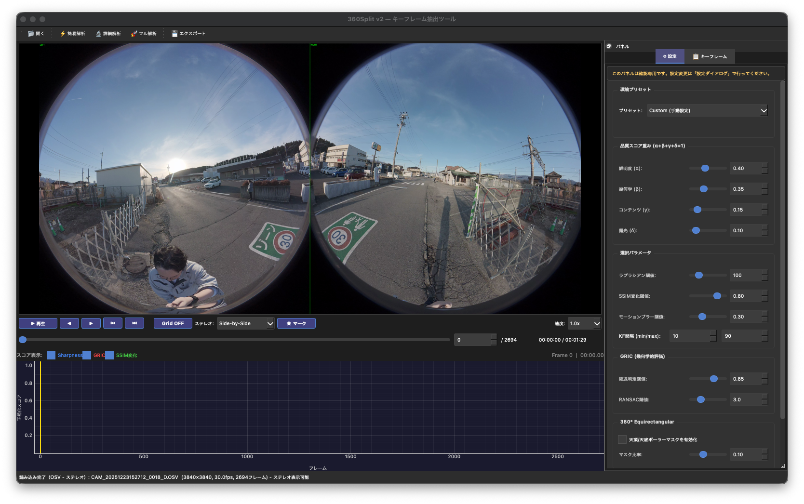

# 360Split

360度動画からフォトグラメトリ・3D Gaussian Splatting (3DGS) 用の最適フレームを自動抽出するデスクトップツールです。

品質評価・幾何学的評価・適応的選択の3軸で動画フレームをスコアリングし、3D再構成に最適なキーフレームを自動選別します。GUIモードとCLIモードの両方に対応しています。

> **最新アップデート（2026年2月）**
> - Visual Odometry（カメラ軌跡推定）モジュールの実験的実装を追加
> - エクスポートダイアログUIの追加
> - 画像I/Oユーティリティの拡張
> - 設定デフォルトの定義を `ConfigManager.default_config()` に一本化
> - ステレオエクスポート時のステッチングモード（Fast/HQ/Depth-aware）を実装
> - 評価済みキーフレーム向けの対象マスク生成（YOLO + SAM）を追加
> - 設定ダイアログに「対象マスク」タブを追加（キーフレーム設定から分離）
> - Stage 2の動体除去（YOLO/SAM + モーション差分）をCLI/GUIから設定可能に
> - 前後魚眼2動画入力（`--front-video`/`--rear-video`）と魚眼外周マスク調整を追加


## 主な特徴

- **4段階統合解析パイプライン** — GUIの「解析実行」1ボタンで Stage0→1→2→3 を順次実行し、軌跡再評価まで一括処理
- **360度映像ネイティブ対応** — Equirectangular / Cubemap / Perspective投影変換をサポート
- **対象マスク生成（GUIエクスポート）** — 選択済みキーフレームに対して人物・車両など指定対象の二値マスク（対象=黒/背景=白）を生成
- **GPU高速化** — Apple Silicon (MPS) / NVIDIA CUDA の自動検出と活用
- **GUIモード** — PySide6ベースの直感的なインタフェースで動画プレビュー、タイムライン操作、リアルタイム分析、解析ログタブ表示が可能
- **CLIモード** — スクリプト連携やバッチ処理に対応したコマンドラインインタフェース
- **クロスプラットフォーム** — macOS (Apple Silicon) / Windows (CUDA) / Linux で動作


## スクリーンショット



## 動作環境

- Python 3.10以上（3.12推奨）
- OS: macOS (Apple Silicon) / Windows 10+ / Linux
- メモリ: 16GB以上推奨（8K映像処理時）
- GPU（オプション）: Apple Silicon (Metal/MPS) または NVIDIA GPU (CUDA 12.1+)


## インストール

### 1. リポジトリのクローン

```bash
git clone https://github.com/KC-nishihana/360split_v2.git
cd 360split
```

### 2. Python仮想環境の作成

```bash
python -m venv venv
source venv/bin/activate  # macOS/Linux
# venv\Scripts\activate   # Windows
```

### 3. 依存パッケージのインストール

```bash
pip install -r requirements.txt
```

### 4. GPU高速化（オプション）

`core/accelerator.py` がハードウェア（MPS/CUDA/CPU）を自動検出します。GPUを使用する場合は以下をインストールしてください。

**Apple Silicon (MPS) の場合:**
```bash
pip install torch torchvision
```

**Windows/Linux (CUDA) の場合:**
```bash
pip install torch torchvision --index-url https://download.pytorch.org/whl/cu121
```

**CUDA対応OpenCV（さらに高速化、オプション）:**

`pip install opencv-contrib-python` の公式ホイールは通常 CUDA 無効です。CUDA ORB などを使うには次のいずれかが必要です。

- OpenCV を `WITH_CUDA=ON` でソースビルドする
- CUDA 対応 OpenCV が同梱された環境（例: Jetson）を使う

手軽なGPU高速化は PyTorch 側（`core/accelerator.py`）を推奨します。

### 5. 対象マスク生成（オプション）

対象マスク生成（YOLO + SAM）を利用する場合は `ultralytics` を追加インストールしてください。

```bash
pip install ultralytics
```


## 使い方

### GUIモード

```bash
python main.py
```

GUIが起動したら、メニューまたはツールバーから動画ファイルを読み込み、「解析実行」でキーフレーム抽出を開始します。
右側パネルの `🧾 解析ログ` タブで、処理内容・進捗・結果ログを確認できます。

### CLIモード

```bash
# 基本的な使い方
python main.py --cli input_video.mp4

# 出力先とフォーマットを指定
python main.py --cli input.mp4 -o ./output --format png

# 360度動画としてCubemapも出力
python main.py --cli input.mp4 --equirectangular --cubemap

# 前後魚眼2動画をペアで処理（ステレオ）
python main.py --front-video front.mp4 --rear-video rear.mp4 -o ./output

# 天底マスク処理を有効化（三脚・撮影者除去）
python main.py --cli input.mp4 --apply-mask

# Stage 2で動体除去を有効化
python main.py --cli input.mp4 --remove-dynamic-objects

# Stage0軽量走査を無効化し、Stage3重みを調整
python main.py --cli input.mp4 --disable-stage0-scan --stage3-weight-trajectory 0.35

# Stage1高速化パラメータを調整（grab閾値・評価スケール）
python main.py --cli input.mp4 --stage1-grab-threshold 45 --stage1-eval-scale 0.33

# Stage3軌跡再評価を無効化（Stage2まで）
python main.py --cli input.mp4 --disable-stage3-refinement

# 魚眼外周マスクを調整（ステレオ入力時）
python main.py --cli input.osv --fisheye-mask-radius-ratio 0.92 --fisheye-mask-center-offset-x 12

# キャリブレーションXMLを指定してVOを有効化（Stage0/Stage3）
python main.py --cli input.mp4 --calib-xml cam.xml --calib-model auto

# キャリブレーション検証モード（抽出は行わない）
python main.py --cli input.mp4 --calib-xml cam.xml --calib-check --calib-check-out ./calib_check
python main.py --front-video front.mp4 --rear-video rear.mp4 \
  --front-calib-xml front.xml --rear-calib-xml rear.xml \
  --calib-check --calib-check-out ./calib_check_pair

# 設定ファイルを指定
python main.py --cli input.mp4 --config settings.json

# 環境プリセットを使用
python main.py --cli input.mp4 --preset outdoor  # 屋外・高品質
python main.py --cli input.mp4 --preset indoor   # 屋内・追跡重視
python main.py --cli input.mp4 --preset mixed    # 混合・適応型

# 詳細ログ出力
python main.py --cli input.mp4 -v
```

#### CLIオプション一覧

| オプション | 説明 | デフォルト |
|---|---|---|
| `--cli VIDEO` | CLIモードで動画を解析 | — |
| `--front-video PATH` | 前後魚眼モード: 前方レンズ動画 | — |
| `--rear-video PATH` | 前後魚眼モード: 後方レンズ動画 | — |
| `-o, --output DIR` | 出力ディレクトリ | `入力動画と同じディレクトリ/keyframes` |
| `--format {png,jpg,tiff}` | 出力画像フォーマット | `png` |
| `--preset {outdoor,indoor,mixed}` | 環境プリセット（下記参照） | — |
| `--max-keyframes N` | 最大キーフレーム数 | 自動決定 |
| `--min-interval N` | 最小キーフレーム間隔（フレーム数） | `5` |
| `--ssim-threshold F` | SSIM変化検知閾値 (0.0-1.0) | `0.85` |
| `--equirectangular` | 入力をEquirectangularとして扱う（入力モード指定。出力変換は `--cubemap`/Perspective指定時） | `false` |
| `--apply-mask` | 天底マスク処理を適用 | `false` |
| `--cubemap` | Cubemap形式でも出力 | `false` |
| `--remove-dynamic-objects` | Stage2動体除去を有効化 | `false` |
| `--dynamic-mask-frames N` | モーション差分に使うフレーム数（2以上） | `3` |
| `--dynamic-mask-threshold N` | モーション差分しきい値（1-255） | `30` |
| `--dynamic-mask-dilation N` | 動体マスク膨張サイズ（0で無効） | `5` |
| `--dynamic-mask-inpaint` | 動体マスクのインペイントフックを有効化 | `false` |
| `--dynamic-mask-inpaint-module MOD` | インペイント処理モジュール名 | `""` |
| `--disable-stage0-scan` | Stage0軽量走査を無効化 | `false` |
| `--stage0-stride N` | Stage0固定サンプリング間隔（フレーム数） | `5` |
| `--stage1-grab-threshold N` | Stage1でgrab方式を使う最大サンプリング間隔 | `30` |
| `--stage1-eval-scale F` | Stage1品質評価の縮小スケール（0.1-1.0） | `0.5` |
| `--disable-stage3-refinement` | Stage3軌跡再評価を無効化 | `false` |
| `--stage3-weight-base F` | Stage3再スコア式のbase重み | `0.70` |
| `--stage3-weight-trajectory F` | Stage3再スコア式のtrajectory重み | `0.25` |
| `--stage3-weight-stage0-risk F` | Stage3再スコア式のstage0リスク重み | `0.05` |
| `--disable-fisheye-border-mask` | 魚眼外周マスクを無効化（ステレオ時の既定ONを上書き） | `false` |
| `--fisheye-mask-radius-ratio F` | 魚眼有効領域の半径比（0.0-1.0） | `0.94` |
| `--fisheye-mask-center-offset-x N` | 魚眼有効領域中心Xオフセット（px） | `0` |
| `--fisheye-mask-center-offset-y N` | 魚眼有効領域中心Yオフセット（px） | `0` |
| `--calib-xml PATH` | 単眼/代表レンズ用キャリブレーションXML | — |
| `--calib-model {auto,opencv,fisheye}` | キャリブレーションモデル（autoはdist係数長で推定） | `auto` |
| `--front-calib-xml PATH` | front/rear入力時のfront XML | — |
| `--rear-calib-xml PATH` | front/rear入力時のrear XML | — |
| `--calib-check` | キャリブレーション検証モード（キーフレーム抽出をスキップ） | `false` |
| `--calib-check-frame N` | 検証に使用するフレーム番号 | サンプル複数 |
| `--calib-check-out DIR` | 検証画像出力先 | `output/calib_check` |
| `--disable-vo` | VOを無効化 | `false` |
| `--vo-center-roi-ratio F` | VOで使用する中心ROI比率（0.2-1.0） | `0.6` |
| `--vo-max-features N` | VOの最大追跡特徴点数 | `600` |
| `--vo-downscale-long-edge N` | VO入力を長辺N pxに縮小 | `1000` |
| `--vo-frame-subsample N` | VOをNフレームごとに計算（1=従来同等） | `1` |
| `--vo-adaptive-roi / --no-vo-adaptive-roi` | VO中心ROIの動的調整を有効/無効化 | `true` |
| `--vo-fast-fail-inlier-ratio F` | VO早期失敗判定の最小inlier比率（0.0-1.0） | `0.12` |
| `--vo-step-proxy-clip-px F` | VO step_proxyの上限クリップ値（px） | `80.0` |
| `--config FILE` | 設定ファイル（JSON） | — |
| `-v, --verbose` | 詳細ログ出力 | `false` |
| `--rerun-stream` | 抽出中にRerunへストリーミング | `false` |
| `--rerun-spawn` | Rerun Viewerを自動起動（`--rerun-stream`時） | `false` |
| `--rerun-save PATH` | Rerunログを`.rrd`で保存 | — |

入力モード:
- `--cli` を指定すると単眼または `.osv`（ステレオ）を処理
- `--front-video` と `--rear-video` を両方指定すると、前後魚眼2動画をステレオペアとして処理
- `--equirectangular` は入力モード指定であり、単体では追加の再投影出力を有効化しません

### Rerunログ（キーフレーム検証）

抽出結果をRerunで可視化し、`metrics/*` の時系列と軌跡を同時に確認できます。

GUIでは右側の`⚙ 設定`パネル（または設定ダイアログ）で
`解析時にRerunログを有効化（GUI）` をONにすると、「解析実行」時にRerunへ送信されます。

```bash
# オンラインストリーミング（Viewer起動）
python main.py --cli input.mp4 --rerun-stream --rerun-spawn

# ストリーミング + .rrd保存
python main.py --cli input.mp4 --rerun-stream --rerun-spawn --rerun-save ./logs/keyframe_check.rrd
```

ログされる主なエンティティ:
- `cam/image`
- `world/cam`
- `world/trajectory`
- `world/keyframes`
- `metrics/translation_delta`
- `metrics/vo_step_proxy`
- `metrics/vo_step_proxy_norm`
- `metrics/vo_inlier_ratio`
- `metrics/vo_rot_deg`
- `metrics/vo_dir_cos_prev`
- `metrics/rotation_delta`
- `metrics/flow_mag`
- `metrics/laplacian_var`
- `metrics/match_count`
- `metrics/overlap_ratio`
- `metrics/exposure_ratio`
- `metrics/keyframe_flag`
- `metrics/stationary_vo_flag`
- `metrics/stationary_flow_flag`
- `metrics/is_stationary`
- `metrics/stationary_confidence`
- `metrics/stationary_penalty_applied`

### オフライン再生（CSV/JSON -> .rrd）

抽出後データ（CSVまたはJSON）を順番に再生して`.rrd`を生成できます。

```bash
python scripts/rerun_offline_replay.py \
  --input ./logs/frame_metrics.json \
  --rrd ./logs/keyframe_offline.rrd \
  --spawn
```

入力レコードの主なキー:
- `frame_index` または `frame_idx`
- `image_path`（任意）
- `t_xyz` / `q_wxyz`（任意、未指定時は既定値）
- `is_keyframe` または `keyframe_flag`
- `metrics`（辞書）または `translation_delta` などの列
- `points_world` または `points_path`（`.npy`、任意）

CLI実行時は `output/frame_metrics.json` が出力され、`records` 配列内に
`frame_index / is_keyframe / t_xyz / q_wxyz / metrics` が保存されます。


## 環境プリセット機能

撮影環境（屋外・屋内・混合）に応じて最適なキーフレーム抽出パラメータを即座に適用できるプリセット管理システムを搭載しています。

### プリセット一覧

#### 🌞 Outdoor (屋外・高品質)
**戦略**: 品質重視。3D Gaussian Splattingの学習データとして最高品質を目指します。

```bash
python main.py --cli video.mp4 --preset outdoor
```

**特徴**:
- **laplacian_threshold: 300.0** — 非常に高い鮮明度を要求
- **motion_blur_threshold: 0.15** — わずかなブレも許容しない
- **min_keyframe_interval: 10** — 遠景が多いため間隔を広げてデータ量を削減
- **weight_sharpness: 0.40** — 鮮明度を最重視

**適用シーン**: 晴天の屋外撮影、建築物の外観、風景の3Dモデル作成

#### 🏠 Indoor (屋内・追跡重視)
**戦略**: 接続性重視。特徴点が少なく暗い環境でもSfMの追跡が切れないことを最優先します。

```bash
python main.py --cli video.mp4 --preset indoor
```

**特徴**:
- **laplacian_threshold: 50.0** — 高感度ノイズやソフトフォーカスを許容
- **motion_blur_threshold: 0.4** — 多少のブレよりもフレーム数を確保
- **weight_geometric: 0.60** — 幾何学的な繋がりを最重視
- **min_feature_matches: 20** — 特徴点が少ない壁面などに対応
- **enable_rescue_mode: true** — レスキューモード有効化

**適用シーン**: 屋内撮影、暗所、テクスチャの少ない環境（オフィス、廊下など）

#### 🌗 Mixed (混合・適応型)
**戦略**: 適応性重視。明暗差（ダイナミックレンジ）の激しい変化に対応します。

```bash
python main.py --cli video.mp4 --preset mixed
```

**特徴**:
- **weight_exposure: 0.40** — 露出の急激な変化を検知
- **ssim_threshold: 0.90** — シーンの変化に敏感に反応
- **adaptive_thresholding: true** — スコア履歴に基づく動的しきい値
- **force_keyframe_on_exposure_change: true** — ドアを抜けた瞬間などの急激な画変わりで強制挿入

**適用シーン**: 屋外⇔屋内の移動、トンネル出入口、明暗差の激しい環境

### GUIでのプリセット使用

GUIモードでは、設定ダイアログの「キーフレーム選択」タブ上部にプリセット選択UIがあります。

1. プリセットを選択すると、全パラメータが即座に更新されます
2. プリセット適用後も、個別のパラメータを微調整可能です
3. 「Custom (手動設定)」を選択すると、プリセット非適用状態になります

設定ダイアログのタブ構成:
- `キーフレーム選択`: 評価・選択パラメータ
- `Stage0/Stage3`: 軽量走査と軌跡再評価の有効化・重み
- `360度処理`: 投影・解像度・ステッチング設定
- `マスク処理`: ナディア/装備マスク設定
- `出力設定`: 出力形式・品質・ディレクトリ
- `対象マスク`: 対象クラス、YOLO/SAMモデル、信頼度閾値、マスク命名規則

### レスキューモード

**Indoor**および**Mixed**プリセットでは、特徴点不足時の「レスキューモード」が有効化されています。

**機能**:
- 特徴点マッチング数が閾値（デフォルト15点）以下の状態が続くと自動的に発動
- Laplacian閾値を一時的に緩和（デフォルト: 50%倍率）
- 画質が低くても、追跡維持のためにキーフレームを強制採用
- GUIタイムライン上で黄色/オレンジ色で表示され、後で確認・削除可能

**目的**: 屋内・暗所でSfMのトラッキングロストを防止


## アーキテクチャ

### プロジェクト構成

```
360split/
├── main.py                  # エントリポイント（GUI/CLI）
├── config.py                # 設定定数・データクラス定義
├── requirements.txt         # 依存パッケージ
├── presets/                 # 環境別プリセット設定
│   ├── outdoor_high_quality.json     # 屋外・高品質プリセット
│   ├── indoor_robust_tracking.json   # 屋内・追跡重視プリセット
│   └── mixed_adaptive.json           # 混合・適応型プリセット
├── core/                    # コアアルゴリズム
│   ├── config_loader.py     # プリセット管理システム
│   ├── accelerator.py       # ハードウェア抽象化レイヤ（MPS/CUDA/CPU自動検出）
│   ├── video_loader.py      # ビデオ読み込み（HWデコード、LRUキャッシュ、プリフェッチ）
│   ├── quality_evaluator.py # 品質評価（ラプラシアン鮮明度、露光、モーションブラー）
│   ├── geometric_evaluator.py # 幾何学的評価（GRIC、特徴点マッチング、光線分散）
│   ├── adaptive_selector.py # 適応的選択（SSIM、オプティカルフロー、カメラ運動量）
│   ├── keyframe_selector.py # 4段階パイプライン統合（Stage0→1→2→3）
│   └── exceptions.py        # カスタム例外定義
├── processing/              # 360度画像処理 / 対象マスク処理
│   ├── equirectangular.py   # Equirectangular ↔ Cubemap / Perspective変換
│   ├── mask_processor.py    # 天底/天頂マスク、撮影機材マスク生成
│   ├── stitching.py         # 画像スティッチング（Fast/HQ/Depth-aware 3モード）
│   ├── object_detector.py   # YOLOベース物体検出
│   ├── instance_segmentor.py # SAMベースインスタンスセグメンテーション
│   └── target_mask_generator.py # 対象マスク生成（OR合成、二値化、保存パス生成）
├── gui/                     # PySide6 GUI
│   ├── main_window.py       # メインウィンドウ、UI統合
│   ├── video_player.py      # 動画プレビュー、フレームナビゲーション
│   ├── timeline_widget.py   # タイムラインUI、pyqtgraphスコアグラフ
│   ├── keyframe_panel.py    # キーフレーム一覧・詳細表示パネル（MainWindowで使用）
│   ├── keyframe_list.py     # 旧キーフレーム一覧ウィジェット（互換用）
│   ├── settings_dialog.py   # 設定ダイアログ（6タブ構成）
│   ├── settings_panel.py    # 設定パネルコンポーネント
│   ├── export_dialog.py     # エクスポートダイアログ（出力設定、フォーマット選択）
│   └── workers.py           # バックグラウンド処理ワーカー（Stage1/2/Export）
├── utils/                   # ユーティリティ
│   ├── logger.py            # ロギングユーティリティ
│   └── image_io.py          # 画像入出力（フォーマット変換、メタデータ保存）
└── test/                    # 開発用テストスクリプト、サンプルデータ
```

### 4段階キーフレーム選択パイプライン

```
入力動画 (360° / 通常)
         │
    ┌────▼─────────────────────────────────────────┐
    │  Stage 0: 軽量走査（固定間隔）                   │
    │  ─────────────────────────────────────────   │
    │  • 低コストの flow/SSIM 走査                     │
    │  • motion_risk（VO不安定リスク）推定              │
    └────┬─────────────────────────────────────────┘
         │ 全体観測（候補は削除しない）
    ┌────▼─────────────────────────────────────────┐
    │  Stage 1: 高速品質フィルタリング                 │
    │  ─────────────────────────────────────────   │
    │  • ラプラシアン鮮明度評価                        │
    │  • モーションブラー検出                         │
    │  • 露光・輝度バランス                           │
    │  • Softmax深度スコアリング                      │
    │  → 全フレームの60〜70%を高速除外                 │
    └────┬─────────────────────────────────────────┘
         │ 候補フレーム (30〜40%)
    ┌────▼─────────────────────────────────────────┐
    │  Stage 2: 精密幾何学・適応評価                  │
    │  ─────────────────────────────────────────    │
    │  • GRIC: ホモグラフィ vs 基礎行列比較          │
    │  • 特徴点マッチングと空間分布評価                │
    │  • SSIM変化量による冗長フレーム除外              │
    │  • オプティカルフロー（カメラ運動量）             │
    │  → Stage2候補 + Stage2最終を生成                 │
    └────┬─────────────────────────────────────────┘
         │
    ┌────▼─────────────────────────────────────────┐
    │  Stage 3: 軌跡再評価・再スコア                   │
    │  ─────────────────────────────────────────   │
    │  • 対象: Stage2候補 ∪ Stage2最終                │
    │  • trajectory_consistency を再計算               │
    │  • Stage0 motion_risk と合成して再スコア          │
    │  → NMS/最大間隔を再実行して最終確定               │
    └────┬─────────────────────────────────────────┘
         │
    最適キーフレーム群 → エクスポート
```


## 設定ファイル

JSON形式の設定ファイルで各パラメータをカスタマイズできます。デフォルト値は `core/config_loader.py` の `ConfigManager.default_config()` で一元管理され、JSON形式でオーバーライド可能です。

```json
{
  "laplacian_threshold": 100.0,
  "motion_blur_threshold": 0.3,
  "softmax_beta": 5.0,
  "gric_degeneracy_threshold": 0.85,
  "min_feature_matches": 15,
  "ssim_threshold": 0.85,
  "min_keyframe_interval": 5,
  "max_keyframe_interval": 60,
  "weight_sharpness": 0.30,
  "weight_exposure": 0.15,
  "weight_geometric": 0.30,
  "weight_content": 0.25,
  "enable_polar_mask": true,
  "mask_polar_ratio": 0.10,
  "enable_stereo_stitch": true,
  "stitching_mode": "Fast",
  "output_image_format": "png",
  "output_jpeg_quality": 95,
  "enable_target_mask_generation": false,
  "target_classes": ["人物", "人", "自転車", "バイク", "車両", "動物"],
  "yolo_model_path": "yolo26n-seg.pt",
  "sam_model_path": "sam3_t.pt",
  "confidence_threshold": 0.25,
  "detection_device": "auto",
  "mask_output_dirname": "masks",
  "mask_add_suffix": true,
  "mask_suffix": "_mask",
  "mask_output_format": "same",
  "enable_fisheye_border_mask": true,
  "fisheye_mask_radius_ratio": 0.94,
  "fisheye_mask_center_offset_x": 0,
  "fisheye_mask_center_offset_y": 0,
  "enable_dynamic_mask_removal": false,
  "dynamic_mask_use_yolo_sam": true,
  "dynamic_mask_use_motion_diff": true,
  "dynamic_mask_motion_frames": 3,
  "dynamic_mask_motion_threshold": 30,
  "dynamic_mask_dilation_size": 5,
  "enable_stage0_scan": true,
  "stage0_stride": 5,
  "enable_stage3_refinement": true,
  "stage3_weight_base": 0.70,
  "stage3_weight_trajectory": 0.25,
  "stage3_weight_stage0_risk": 0.05,
  "dynamic_mask_target_classes": ["人物", "人", "自転車", "バイク", "車両", "動物"],
  "dynamic_mask_inpaint_enabled": false,
  "dynamic_mask_inpaint_module": ""
}
```

### 主要パラメータ

| パラメータ | 説明 | デフォルト値 |
|---|---|---|
| `laplacian_threshold` | ラプラシアン鮮明度の最小閾値（Stage 1）。低いほどブレたフレームも許容 | 100.0 |
| `motion_blur_threshold` | モーションブラー許容閾値。高いほど動きのあるフレームも許容 | 0.3 |
| `ssim_threshold` | SSIM変化検知閾値。低いほど大きな変化のみキーフレームとして採用 | 0.85 |
| `min_keyframe_interval` | キーフレーム間の最小フレーム数 | 5 |
| `max_keyframe_interval` | キーフレーム間の最大フレーム数（超過時は強制挿入） | 60 |
| `weight_sharpness` | 鮮明度スコアの重み（α） | 0.30 |
| `weight_geometric` | 幾何学的スコアの重み（β、GRIC） | 0.30 |
| `weight_content` | コンテンツ変化スコアの重み（γ、SSIM） | 0.25 |
| `weight_exposure` | 露光スコアの重み（δ） | 0.15 |
| `gric_degeneracy_threshold` | GRIC縮退判定閾値。高いほど回転のみシーンを除外しやすい | 0.85 |
| `enable_polar_mask` | 360度動画の天頂/天底マスク有効化 | true |
| `mask_polar_ratio` | 天頂/天底マスク比率（上下の何%をマスクするか） | 0.10 |
| `enable_target_mask_generation` | キーフレーム出力後に対象マスクを生成 | false |
| `target_classes` | 検出対象ラベル（複数選択可） | `["人物","人","自転車","バイク","車両","動物"]` |
| `yolo_model_path` | YOLOモデル名/パス | `yolo26n-seg.pt` |
| `sam_model_path` | SAMモデル名/パス | `sam3_t.pt` |
| `confidence_threshold` | 検出信頼度閾値 | 0.25 |
| `detection_device` | 推論デバイス（`auto/cpu/mps/cuda/0`） | `auto` |
| `mask_output_dirname` | マスク出力ディレクトリ名 | `masks` |
| `mask_add_suffix` | マスクファイル名に接尾辞を付与 | true |
| `mask_suffix` | マスクファイル接尾辞 | `_mask` |
| `mask_output_format` | マスク拡張子（`same/png/jpg/tiff`） | `same` |
| `enable_fisheye_border_mask` | ステレオ入力時の魚眼外周マスク | true |
| `enable_stage0_scan` | Stage0軽量走査の有効化 | true |
| `stage0_stride` | Stage0固定サンプリング間隔（フレーム） | 5 |
| `enable_stage3_refinement` | Stage3軌跡再評価の有効化 | true |
| `stage3_weight_base` | Stage3再スコア式の base 重み | 0.70 |
| `stage3_weight_trajectory` | Stage3再スコア式の trajectory 重み | 0.25 |
| `stage3_weight_stage0_risk` | Stage3再スコア式の Stage0リスク重み | 0.05 |
| `fisheye_mask_radius_ratio` | 魚眼有効領域の半径比（0.0-1.0） | 0.94 |
| `enable_dynamic_mask_removal` | Stage2で動体領域を除外 | false |
| `dynamic_mask_use_yolo_sam` | YOLO/SAMベース動体検出を併用 | true |
| `dynamic_mask_use_motion_diff` | モーション差分動体検出を併用 | true |
| `dynamic_mask_motion_threshold` | モーション差分しきい値 | 30 |


## 出力

### キーフレーム画像

指定フォーマット（PNG/JPEG/TIFF）で出力されます。ファイル名にはフレーム番号が含まれます。

```
output/
├── keyframe_000000.png
├── keyframe_000150.png
├── keyframe_000312.png
├── ...
├── keyframe_metadata.json
└── cubemap/                    # --cubemap指定時
    ├── front/
    │   ├── keyframe_000000_front.png
    │   └── ...
    ├── back/
    ├── left/
    ├── right/
    ├── top/
    └── bottom/
    └── ...
```

### 対象マスク画像（有効時）

対象検出を有効化した場合（GUIのエクスポートダイアログ経由）、キーフレームと同じ相対構造で `masks/` 配下へ保存されます。

```
output/
├── images
│   ├── L/
│   │   ├── keyframe_000150_L.png
│   │   └── ...
│   └── R/
│       ├── keyframe_000150_R.png
│       └── ...
└── masks/
    ├── keyframe_000150_L_mask.png
    ├── keyframe_000150_R_mask.png
    └── ...
```

- 画素値: 対象領域 `0`（黒）、背景 `255`（白）
- 対象未検出フレーム: 全白マスク
- 命名規則: `mask_add_suffix` / `mask_suffix` / `mask_output_format` で変更可能

### メタデータ (keyframe_metadata.json)

各キーフレームのスコア詳細を含むJSONファイルが自動生成されます。フォトグラメトリソフトウェアとの連携や後処理スクリプトの入力として利用できます。
`calibration` セクションと `settings.calibration_runtime` に、実際に使われた `K/dist/model/image_size/xml_path` が保存されます（再現性確保用）。


## VO実装範囲（今回）

- VOは Stage0 / Stage3 のみで計算されます（Stage2で新規VO計算はしません）。
- Stage2のstationary判定は Stage0由来の `vo_step_proxy_norm / rotation_delta / match_count` を優先参照します（`vo_step_proxy_norm` が無い場合のみ `translation_delta` をフォールバック）。
- パノラマVO（equirect/cubemap/stitch_to_equirect）は今回対象外です。該当ケースでは警告ログを出してスキップします。
- paired入力（OSV/front_rear）でもVOは代表レンズ（frame_a/front）のみで実行します。
- `translation_delta` は互換メトリクスとして保持されますが、**実距離（meter）ではありません**。Stage0/Stage3の移動量評価には `vo_step_proxy`（inlier parallax）と `vo_step_proxy_norm`（median(step)=1 正規化）を使用します。
- `world/trajectory` は単眼VOの相対軌跡（arbitrary scale）です。実スケール推定は行いません。
- 高速化オプション（`vo_frame_subsample`, `vo_adaptive_roi`, `vo_fast_fail_inlier_ratio`, `vo_step_proxy_clip_px`）は速度向上と引き換えに、難シーンで `vo_valid` が減る可能性があります。

### VOが見えない場合の確認手順

1. キャリブレーションXMLを指定してください（未指定時はVO無効）。
2. 実行後に `vo_diagnostics.json` を確認してください。
3. 軌跡の詳細は `vo_trajectory.csv` を確認してください。

CLI例:
```bash
python main.py --cli test/CAM_20260205141214_0023_D.OSV \
  --calib-xml test/camcalib1.xml --calib-model auto \
  --output /tmp/vo_check
```

`vo_diagnostics.json` の主要項目:
- `vo_attempted_frames`: VO推定を試行したフレーム数
- `vo_valid_frames`: `vo_valid=1` のフレーム数
- `vo_valid_ratio`: `vo_valid_frames / vo_attempted_frames`
- `vo_pose_valid_frames`: Stage3統合で姿勢 `t_xyz` が直接付与されたフレーム数
- `vo_status_reason_counts`: 無効理由・状態の内訳（例: `calibration_unavailable`）

`vo_trajectory.csv` の列:
- `frame_idx,t_x,t_y,t_z,q_w,q_x,q_y,q_z,vo_valid,vo_inlier_ratio,vo_step_proxy`

注意:
- 単眼VOのためスケールは相対値です。`t_x/t_y/t_z` は実距離（m）ではありません。


## ライセンス

本リポジトリ本体のライセンスは `MIT` です。詳細は `LICENSE` を参照してください。

本プロジェクトで使用している主要技術・ライブラリのライセンスは以下です（2026-02-22時点）。

| 区分 | 技術/ライブラリ | ライセンス |
|---|---|---|
| 必須依存 | PySide6 (Qt for Python) | `LGPL-3.0-only OR GPL-2.0-only OR GPL-3.0-only` |
| 必須依存 | OpenCV (`opencv-python`) | `Apache-2.0` |
| 必須依存 | NumPy | `BSD-3-Clause` |
| 必須依存 | pyqtgraph | `MIT` |
| 必須依存 | rerun-sdk | `MIT OR Apache-2.0` |
| オプション依存 | PyTorch (`torch`) | `BSD-3-Clause` |
| オプション依存 | torchvision | `BSD` |
| オプション依存 | Ultralytics (`ultralytics`) | `AGPL-3.0` |

ロジック（アルゴリズム）について:
- 本ツールのキーフレーム選定ロジック（ラプラシアン鮮明度、SSIM、GRIC、特徴点マッチング、光学フロー等）は、数理手法・古典的CV手法の組み合わせです。
- これらの「手法そのもの」には通常ソフトウェア著作権ライセンスは直接適用されませんが、実装に利用するライブラリのライセンス遵守が必要です。

注意:
- 本体コードは MIT ですが、利用する依存ライブラリには各ライセンスが適用されます（特に `ultralytics` は `AGPL-3.0`）。
- 学習済み重みファイル（例: `yolo26x-seg.pt`, `sam3.pt`）には提供元の個別ライセンス/利用規約が適用されます。
